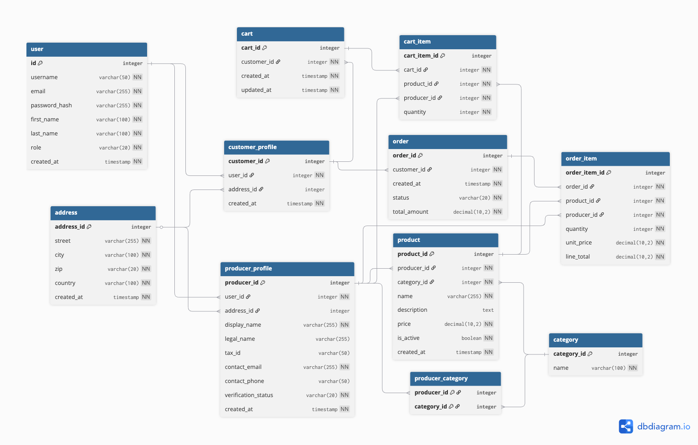

{: .label }
[]

{: .no_toc }
# Data model

{: .text-delta }

Table of contents

- ToC
{: toc }

## Visual overview

## user

The user table stores all authenticated accounts for the platform (both customers and producers). Each user has an integer id primary key and attributes such as username, email, password_hash, first_name, last_name, role, and created_at. The role column is a design decision that lets us distinguish different user types (for example customer vs producer) in a single table instead of separate customer/producer user tables.

## address

The address table holds reusable address records with address_id as the primary key. It includes fields like street, city, zip, country, and created_at. Both customers and producers reference addresses via foreign keys, which is a design decision to avoid duplicating address fields in multiple tables and to allow an address to be updated in one place.

## customer_profile

The customer_profile table represents the customer role of a user. The primary key is customer_id, and it references user.id and address.address_id via user_id and address_id. This creates a one‑to‑one (or one‑to‑few) relationship between a user and their customer profile, and between a customer and their address. Separating customer_profile from user is a design decision to keep authentication data and customer‑specific data modular.

## producer_profile

The producer_profile table represents the producer role of a user. Its primary key is producer_id, and it also references user.id and address.address_id via user_id and address_id. Additional attributes such as display_name, legal_name, tax_id, contact_email, contact_phone, verification_status, and created_at describe the business entity. Using a dedicated producer_profile linked to user is a design decision that allows one authentication system while keeping producer‑specific business data separate and extensible.

## category

The category table defines product categories. It has a primary key category_id and a name field. This table normalizes category names and allows them to be reused across products instead of storing category text directly on the product.

## producer_category

The producer_category table models a many‑to‑many relationship between producers and categories. It contains composite keys producer_id and category_id, which reference producer_profile.producer_id and category.category_id. This is a design decision to allow each producer to be associated with multiple categories and each category to have multiple producers, without duplicating data in either main table.

## product

The product table stores all products offered on the platform. The primary key is product_id. Each product references producer_profile and category through producer_id and category_id, and includes attributes such as name, description, price, is_active, and created_at. The foreign keys enforce that each product belongs to exactly one producer and one category, reflecting the business rules of the marketplace.

## cart

The cart table represents a shopping cart for a customer. Its primary key is cart_id, and it references the customer via customer_id (linked to customer_profile.customer_id). It includes created_at and updated_at timestamps. Having a separate cart table per customer supports features like persistent carts and tracking the lifecycle of a cart.

## cart_item

The cart_item table holds individual items within a cart. The primary key is cart_item_id. Each cart_item references a specific cart via cart_id, a product via product_id, and the producer_profile via producer_id, plus a quantity field. Storing both product_id and producer_id is a deliberate design decision that denormalizes slightly to make querying cart items by producer easier and more robust, even if product–producer relationships change.

## order

The order table represents a placed order derived from a cart. The primary key is order_id, and it references the customer via customer_id. It includes created_at, status, and total_amount. This table tracks the overall order lifecycle and aggregates monetary values.

## order_item

The order_item table stores line items belonging to an order. The primary key is order_item_id. It references order via order_id, product via product_id, and producer_profile via producer_id, and contains quantity, unit_price, and line_total. Mirroring product_id and producer_id here (even though they are related) is an intentional design decision to snapshot the state of the product–producer relationship and pricing at order time and to simplify downstream reporting per producer.
